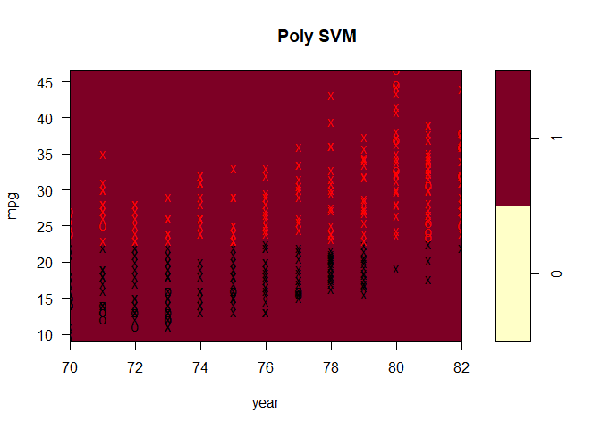

# SVM Application in R

## use support vector approaches to predict whether a given car gets high or low gas mileage based on the Auto data set.

### author: Yi Rong

### update on 12/30/20

### (1)

Create a binary variable that takes on a 1 for cars with gas mileage
above the median, and a 0 for cars with gas mileage below the median.

``` r
library(ISLR)
```

    ## Warning: package 'ISLR' was built under R version 3.6.3

``` r
library(e1071)
```

    ## Warning: package 'e1071' was built under R version 3.6.3

``` r
attach(Auto)
## a
mpglevel <- rep(0, nrow(Auto))
mpglevel[Auto$mpg > median(Auto$mpg)] <- 1
Auto$mpglevel <- as.factor(mpglevel)
```

### (2)

Fit a support vector classifier to the data with various values of cost,
in order to predict whether a car gets high or low gas mileage.
Determine the best value of this parameter using the cross-validation
errors associated with different values of this parameter.

``` r
## b
set.seed(115)
tune.linear <- tune(svm, mpglevel ~ ., data = Auto, kernel = "linear", 
                 ranges = list(cost = c(0.001, 0.01, 0.1, 1, 5, 10, 100)))
summary(tune.linear)
```

    ## 
    ## Parameter tuning of 'svm':
    ## 
    ## - sampling method: 10-fold cross validation 
    ## 
    ## - best parameters:
    ##  cost
    ##     1
    ## 
    ## - best performance: 0.01275641 
    ## 
    ## - Detailed performance results:
    ##    cost      error dispersion
    ## 1 1e-03 0.09448718 0.03852701
    ## 2 1e-02 0.07910256 0.04723643
    ## 3 1e-01 0.04596154 0.02888973
    ## 4 1e+00 0.01275641 0.01344780
    ## 5 5e+00 0.01782051 0.01724506
    ## 6 1e+01 0.02038462 0.01617396
    ## 7 1e+02 0.02551282 0.02093755

``` r
# The least error appears when cost is 1.
```

### (3)

Use SVMs with radial and polynomial basis kernels, with different values
of gamma and degree and cost. Determine the best values of these
parameters.

``` r
## c
# poly
set.seed(116)
tune.poly <- tune(svm, mpglevel ~ ., data = Auto, kernel = "polynomial", 
                 ranges = list(cost = c(0.001, 0.01, 0.1, 1, 5, 10, 100), 
                               degree = c(2, 3, 4)))
summary(tune.poly)
```

    ## 
    ## Parameter tuning of 'svm':
    ## 
    ## - sampling method: 10-fold cross validation 
    ## 
    ## - best parameters:
    ##  cost degree
    ##   100      2
    ## 
    ## - best performance: 0.3036538 
    ## 
    ## - Detailed performance results:
    ##     cost degree     error dispersion
    ## 1  1e-03      2 0.5663462 0.06464673
    ## 2  1e-02      2 0.5663462 0.06464673
    ## 3  1e-01      2 0.5663462 0.06464673
    ## 4  1e+00      2 0.5663462 0.06464673
    ## 5  5e+00      2 0.5663462 0.06464673
    ## 6  1e+01      2 0.5125641 0.11868007
    ## 7  1e+02      2 0.3036538 0.09551069
    ## 8  1e-03      3 0.5663462 0.06464673
    ## 9  1e-02      3 0.5663462 0.06464673
    ## 10 1e-01      3 0.5663462 0.06464673
    ## 11 1e+00      3 0.5663462 0.06464673
    ## 12 5e+00      3 0.5663462 0.06464673
    ## 13 1e+01      3 0.5663462 0.06464673
    ## 14 1e+02      3 0.3369872 0.13380097
    ## 15 1e-03      4 0.5663462 0.06464673
    ## 16 1e-02      4 0.5663462 0.06464673
    ## 17 1e-01      4 0.5663462 0.06464673
    ## 18 1e+00      4 0.5663462 0.06464673
    ## 19 5e+00      4 0.5663462 0.06464673
    ## 20 1e+01      4 0.5663462 0.06464673
    ## 21 1e+02      4 0.5663462 0.06464673

``` r
# The least error appears when cost is 100 and degree is 2.

# radial
set.seed(117)
tune.radial <- tune(svm, mpglevel ~ ., data = Auto, kernel = "radial", 
                 ranges = list(cost = c(0.001, 0.01, 0.1, 1, 5, 10, 100), 
                               gamma = c(0.001, 0.01, 0.1, 1, 5, 10, 100)))
summary(tune.radial)
```

    ## 
    ## Parameter tuning of 'svm':
    ## 
    ## - sampling method: 10-fold cross validation 
    ## 
    ## - best parameters:
    ##  cost gamma
    ##   100  0.01
    ## 
    ## - best performance: 0.01282051 
    ## 
    ## - Detailed performance results:
    ##     cost gamma      error dispersion
    ## 1  1e-03 1e-03 0.57160256 0.05589806
    ## 2  1e-02 1e-03 0.57160256 0.05589806
    ## 3  1e-01 1e-03 0.55378205 0.07189557
    ## 4  1e+00 1e-03 0.09461538 0.03670639
    ## 5  5e+00 1e-03 0.07660256 0.02949531
    ## 6  1e+01 1e-03 0.07403846 0.02806760
    ## 7  1e+02 1e-03 0.02551282 0.02689559
    ## 8  1e-03 1e-02 0.57160256 0.05589806
    ## 9  1e-02 1e-02 0.57160256 0.05589806
    ## 10 1e-01 1e-02 0.09205128 0.03495298
    ## 11 1e+00 1e-02 0.07660256 0.02949531
    ## 12 5e+00 1e-02 0.04852564 0.03281435
    ## 13 1e+01 1e-02 0.02294872 0.02227517
    ## 14 1e+02 1e-02 0.01282051 0.01813094
    ## 15 1e-03 1e-01 0.57160256 0.05589806
    ## 16 1e-02 1e-01 0.22775641 0.09291705
    ## 17 1e-01 1e-01 0.07666667 0.02973726
    ## 18 1e+00 1e-01 0.04846154 0.03511978
    ## 19 5e+00 1e-01 0.03070513 0.02357884
    ## 20 1e+01 1e-01 0.02557692 0.01709522
    ## 21 1e+02 1e-01 0.02820513 0.02821808
    ## 22 1e-03 1e+00 0.57160256 0.05589806
    ## 23 1e-02 1e+00 0.57160256 0.05589806
    ## 24 1e-01 1e+00 0.57160256 0.05589806
    ## 25 1e+00 1e+00 0.06134615 0.03233782
    ## 26 5e+00 1e+00 0.06134615 0.03657786
    ## 27 1e+01 1e+00 0.06134615 0.03657786
    ## 28 1e+02 1e+00 0.06134615 0.03657786
    ## 29 1e-03 5e+00 0.57160256 0.05589806
    ## 30 1e-02 5e+00 0.57160256 0.05589806
    ## 31 1e-01 5e+00 0.57160256 0.05589806
    ## 32 1e+00 5e+00 0.51051282 0.06828266
    ## 33 5e+00 5e+00 0.50282051 0.06360792
    ## 34 1e+01 5e+00 0.50282051 0.06360792
    ## 35 1e+02 5e+00 0.50282051 0.06360792
    ## 36 1e-03 1e+01 0.57160256 0.05589806
    ## 37 1e-02 1e+01 0.57160256 0.05589806
    ## 38 1e-01 1e+01 0.57160256 0.05589806
    ## 39 1e+00 1e+01 0.52833333 0.07814427
    ## 40 5e+00 1e+01 0.52070513 0.08375853
    ## 41 1e+01 1e+01 0.52070513 0.08375853
    ## 42 1e+02 1e+01 0.52070513 0.08375853
    ## 43 1e-03 1e+02 0.57160256 0.05589806
    ## 44 1e-02 1e+02 0.57160256 0.05589806
    ## 45 1e-01 1e+02 0.57160256 0.05589806
    ## 46 1e+00 1e+02 0.57160256 0.05589806
    ## 47 5e+00 1e+02 0.57160256 0.05589806
    ## 48 1e+01 1e+02 0.57160256 0.05589806
    ## 49 1e+02 1e+02 0.57160256 0.05589806

``` r
# The least error appears when cost is 100 and gamma is 0.01.

best.linear <- svm(mpglevel ~ ., data = Auto, kernel = "linear", cost = 1)
best.poly <- svm(mpglevel ~ ., data = Auto, kernel = "polynomial", cost = 100, degree = 2)
best.radial <- svm(mpglevel ~ ., data = Auto, kernel = "radial", cost = 100, gamma = 0.01)
```

### (4)

Make some plots to visualize SVMs created in (b) and (c).

``` r
names.Auto <- names(Auto)[-c(1, 9, 10)]
for (name in names.Auto) {
  par(col.main='white')
  plot(best.linear, Auto, as.formula(paste("mpg~", name, sep = "")), main="")
  par(col.main='black')
  title("Linear SVM")
  }
```

<!-- --><!-- --><!-- --><!-- --><!-- --><!-- --><!-- -->

``` r
for (name in names.Auto) {
  par(col.main='white')
  plot(best.poly, Auto, as.formula(paste("mpg~", name, sep = "")), main="")
  par(col.main='black')
  title("Poly SVM")
}
```

<!-- --><!-- --><!-- --><!-- --><!-- --><!-- --><!-- -->

``` r
for (name in names.Auto) {
  par(col.main='white')
  plot(best.radial, Auto, as.formula(paste("mpg~", name, sep = "")), main="")
  par(col.main='black')
  title("Radial SVM")
}
```

<!-- --><!-- --><!-- --><!-- --><!-- --><!-- --><!-- -->
